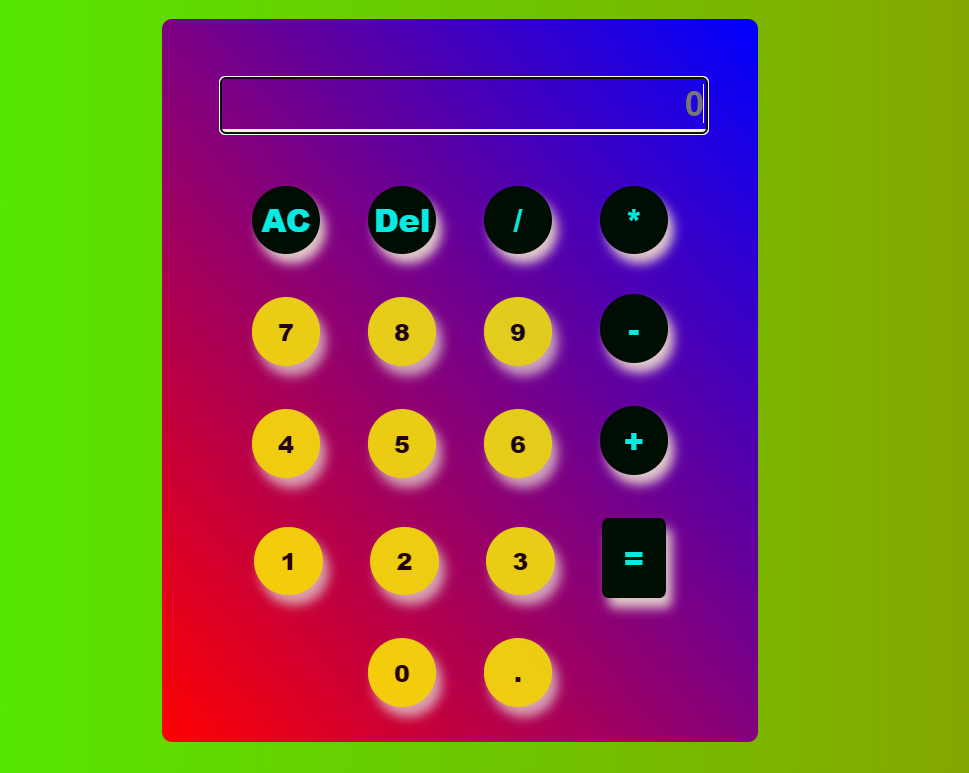

CALCULATOR app

Ovaj projekat predstavlja jednostavnu kalkulator aplikaciju napravljenu pomoću TypeScript-a. Kalkulator podržava osnovne aritmetičke operacije i ima jednostavan korisnički interfejs koji omogućava lako korišćenje.

## Funkcionalnosti

- **Osnovne Operacije:**
  - Sabiranje, oduzimanje, množenje i deljenje.
  
- **Tastatura:**
  - Mogućnost unosa brojeva i operacija direktno sa tastature.

- **Specijalna Dugmad:**
  - **DEL**: Briše poslednji uneti karakter.
  - **AC**: Briše ceo unos (resetuje kalkulator).
  - **=**: Izvršava izračunavanje unetog izraza.

## Tehnologije Korišćene

- **TypeScript**: Za robustniji kod sa statičkom tipizacijom.
- **HTML**: Za strukturiranje korisničkog interfejsa.
- **CSS**: Za stilizovanje interfejsa i prilagođavanje izgleda aplikacije.

